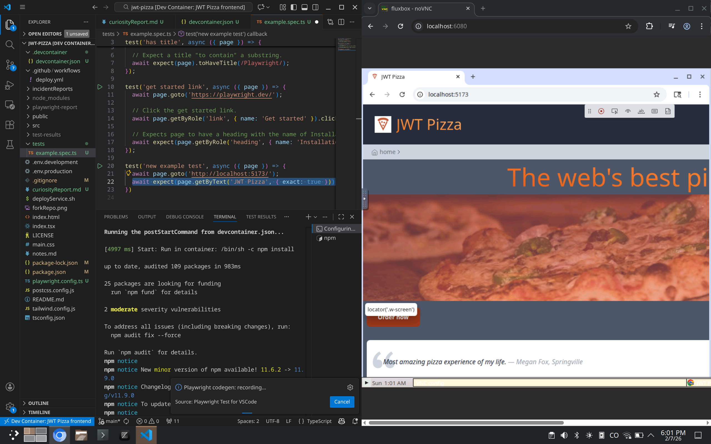

# Curiosity Report: Reproducible Development Environments with Development Containers

## Why I chose this topic
As I started to install Playwright in class, I started running into issues: The installation script, upon deducing that I was on a Linux machine, assumed I was on Ubuntu or an Ubuntu-combatible distro and tried to use `apt` to install the required libraries. However, since I don't use an Ubuntu compatible distro (I use Arch by the way), Playwright was not able to find and install its dependencies. After a quick search, I found that even if I did install the same packages through my package manager, the files were named differently, so I would have to manually symlink the libraries. Instead of using such a manual and brittle solution (an update to either Playwright or my system libraries could have broken it), I turned elsewhere to fix the issue: I had used dev containers a couple of times, and I decided I wanted to learn more about them and use them to solve my problem.

## What are Dev Containers?
Development containers, more commonly known as dev containers, are containers that are used to provide a reproducible environment for development. The dev container contains the software used for development (in our case, `npm` and the libraries depended on by Playwright) and runs in a container runtime, such as Docker. The IDE then integrates with the dev container, so that the IDE and associated tools (like VS Code's integrated terminal) run in the container, rather than on the local system. Using containers allows for greater simplicity, automation, and flexibility. Rather than having to install dependencies manually, the IDE automatically builds or downloads a container that contains the specified dependencies. Containers are much more lightweight than the alternative of a virtual machine or a dedicated remote development server. However, if needed, dev containers can be configured to run remotely.

## Dev Container Configuration
Dev containers are typically configured in a `.devcontainer` directory at the root of the project. This folder contains a file named `devcontainer.json` that contains the information that the IDE needs to set up and start the container. My simple `devcontainer.json` file contained the following:

```json
{
   // The name of the dev container
  "name": "JWT Pizza frontend",
  // The container can either be specified with `image` or with `build`.
  // Since Microsoft maintains a Playwright container, we use that.
  // If we needed a custom container, we could write our own Dockerfile and reference it in `build.dockerfile`.
  "image": "mcr.microsoft.com/playwright:v1.58.2",
  // Forward ports 5173 (Vite), 6080 (desktop-lite), and 9323 (Playwright).
  // This allows us to access the services from outside of our dev container
  "forwardPorts": [5173, 6080, 9323],
  // `features` provides a way to add automatically tools to a container.
  // We add "desktop-lite", which gives Playwright a place to display windows (e.g. for recording tests).
  // We can access the desktop through a browser on port 6080.
  "features": { 
    "desktop-lite": {
      "webPort": "6080"
    }
  },
  // Runs `npm install` in the container before accessing it.
  "postStartCommand": "npm install",
  // Allows us to add IDE-specific customizations.
  // Here, we tell VS Code to install the Playwright extension into the container.
  "customizations": {
    "vscode": {
      "extensions": ["ms-playwright.playwright"]
    }
  }
}
```

## Usage
Once the dev container has been set up, using it is simple. When opening your project, VS Code detects the dev container configuration file and prompts you to reopen the project in the container. When you do so, the container will automatically be built and accessed. This may take a while the first time, but will be fast for successive uses, as the container image is cached. VS Code and Playwright can then be used with no issues, and the desktop can be accessed at `localhost:6080`.


*VS Code open in the dev container, using Playwright to generate a new test, accessing the container's desktop through the browser.*

## Conclusion
Dev containers provide a very powerful way of making sure your development environment is consistent across all platforms. They allowed me to easily use Playwright on my system, even though Playwright's installer didn't work for me. There are some hoops to jump through, like having to forward ports to access them from outside of the container or having to use a browser to access the desktop, but the power and flexibility they provide is well worth it. Now that I understand how dev containers work and know how to create them for myself, I plan to continue using them in my projects.
