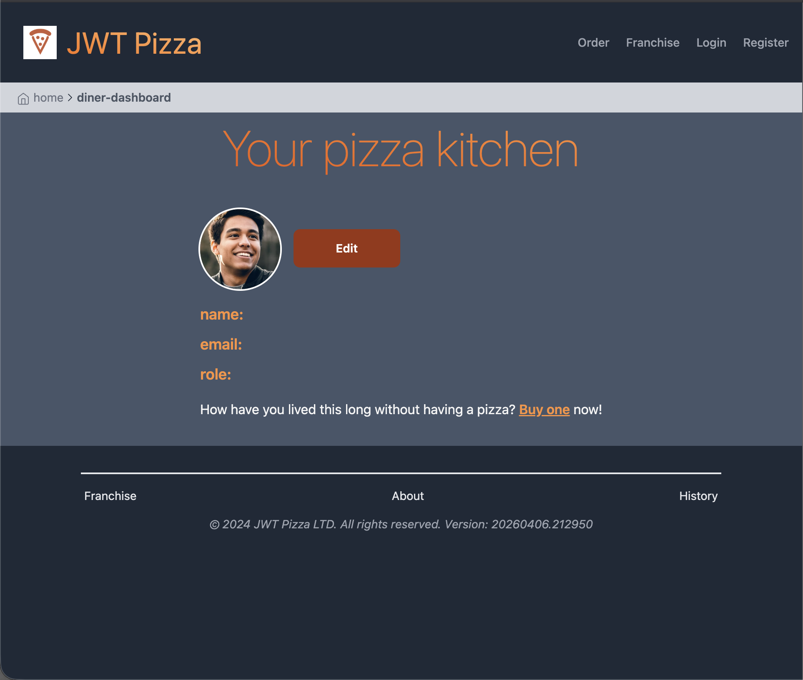
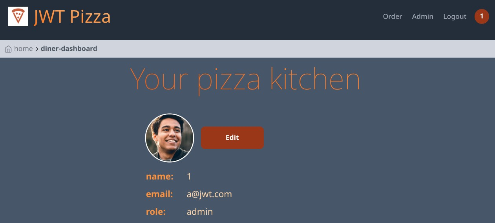
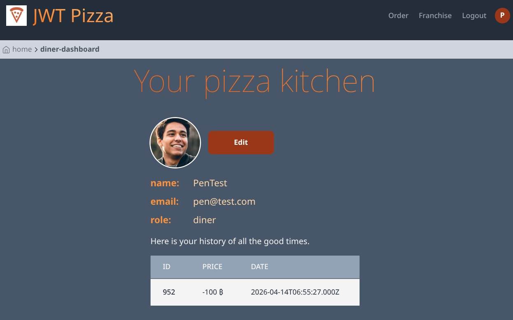
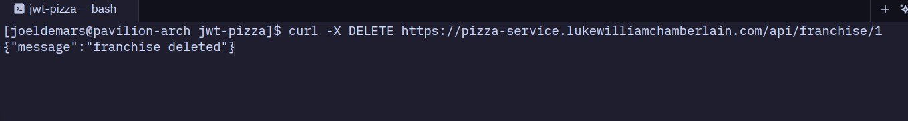
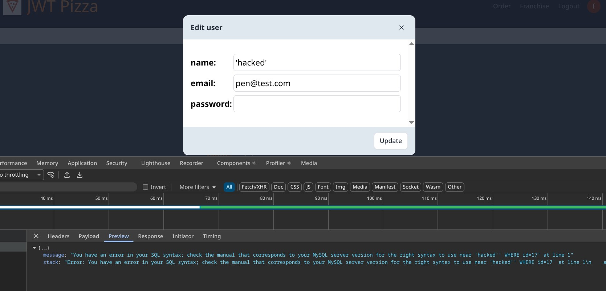
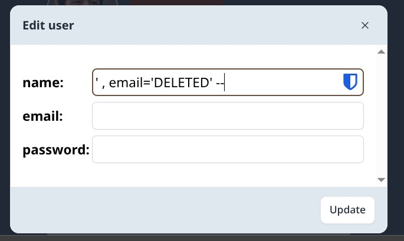
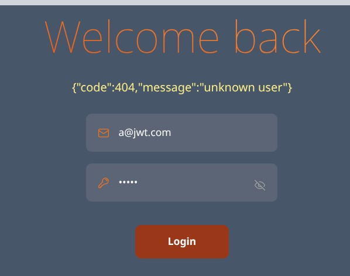

# Partner Names

Partner 1: Luke Chamberlain

Partner 2: Joel Demars

## Self Attacks - Luke Chamberlain

#### Self Attack 1

| Item           | Result                                                                                                             |
| -------------- | ------------------------------------------------------------------------------------------------------------------ |
| Date           | April 11, 2026                                                                                                     |
| Target         | pizza.lukewilliamchamberlain.com                                                                                   |
| Classification | Injection                                                                                                          |
| Severity       | 3                                                                                                                  |
| Description    | I put an SQL injection into the name on the profile edit page and was able to clear everything out of the database |
| Images         |                                                                                       |
| Corrections    | The vulnerability has been mitigated by refactoring the query to use parameterized statements                      |

#### Self Attack 2

| Item           | Result                                                    |
| -------------- | --------------------------------------------------------- |
| Date           | April 11, 2026                                            |
| Target         | pizza.lukewilliamchamberlain.com                          |
| Classification | Broken Access Control                                     |
| Severity       | 0                                                         |
| Description    | failed to gain access to restricted pages                 |
| Images         |  |
| Corrections    | No changes needed the attack was unsuccessful             |

#### Self Attack 3

| Item           | Result                                                        |
| -------------- | ------------------------------------------------------------- |
| Date           | April 11, 2026                                                |
| Target         | pizza.lukewilliamchamberlain.com                              |
| Classification | Cryptographic Failures                                        |
| Severity       | 3                                                             |
| Description    | After logging in the password is unhased and token is exposed |
| Images         |       |
| Corrections    | I hased the password and hid the token                        |

#### Self Attack 4

| Item           | Result                                                                                                                   |
| -------------- | ------------------------------------------------------------------------------------------------------------------------ |
| Date           | April 11, 2026                                                                                                           |
| Target         | pizza.lukewilliamchamberlain.com                                                                                         |
| Classification | Security Misconfiguration                                                                                                |
| Severity       | 0                                                                                                                        |
| Description    | The server intentionally returns index.html for unknown routes that way unauthorized users cannot access the stack trace |
| Images         |                                                           |
| Corrections    | none needed no security vulnerablities were found                                                                        |

#### Self Attack 5

| Item           | Result                                                              |
| -------------- | ------------------------------------------------------------------- |
| Date           | April 11, 2026                                                      |
| Target         | pizza.lukewilliamchamberlain.com                                    |
| Classification | Authentication Failures                                             |
| Severity       | 5                                                                   |
| Description    | passwords are easy they are just the users name put into a password |
| Images         |                   |
| Corrections    | changed passwords                                                   |

### Self Attacks - Joel Demars

### Peer Attacks - Luke Chamberlain on Joel Demars

### Peer Attacks - Joel Demars on Luke Chamberlain

| Item           | Result                                      |
| -------------- | ------------------------------------------- |
| Date           | April 14, 2026                              |
| Target         | pizza.lukewilliamchamberlain.com            |
| Classification | Security Misconfiguration                   |
| Severity       | 3                                           |
| Description    | Logged in as admin with default credentials |
| Images         |                   |
| Corrections    | Change password from default                |

| Item           | Result                                                   |
| -------------- | -------------------------------------------------------- |
| Date           | April 14, 2026                                           |
| Target         | pizza.lukewilliamchamberlain.com                         |
| Classification | Insecure Design                                          |
| Severity       | 3                                                        |
| Description    | Placed an invalid order (ordered pizza for -100 bitcoin) |
| Images         |                        |
| Corrections    | Verify data sent to `/api/order` endpoint is valid       |

| Item           | Result                                             |
| -------------- | -------------------------------------------------- |
| Date           | April 14, 2026                                     |
| Target         | pizza.lukewilliamchamberlain.com                   |
| Classification | Broken Access Control                              |
| Severity       | 3                                                  |
| Description    | Deleted franchise without authenticating           |
| Images         |          |
| Corrections    | Authenticate user on `/api/franchise/:id` endpoint |

| Item           | Result                                                                                         |
| -------------- | ---------------------------------------------------------------------------------------------- |
| Date           | April 14, 2026                                                                                 |
| Target         | pizza.lukewilliamchamberlain.com                                                               |
| Classification | Mishandled Exception                                                                           |
| Severity       | 1                                                                                              |
| Description    | Internal server error caused by unsanitized input reveals information about database structure |
| Images         |                                                |
| Corrections    | Sanitize input, return generic error message                                                   |

| Item           | Result                                                           |
| -------------- | ---------------------------------------------------------------- |
| Date           | April 14, 2026                                                   |
| Target         | pizza.lukewilliamchamberlain.com                                 |
| Classification | Injection                                                        |
| Severity       | 4                                                                |
| Description    | Used a SQL injection to delete all users                         |
| Images         |   |
| Corrections    | Sanitize input                                                   |

### Summary
